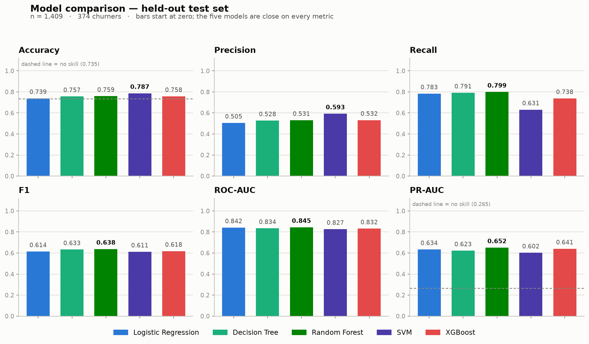
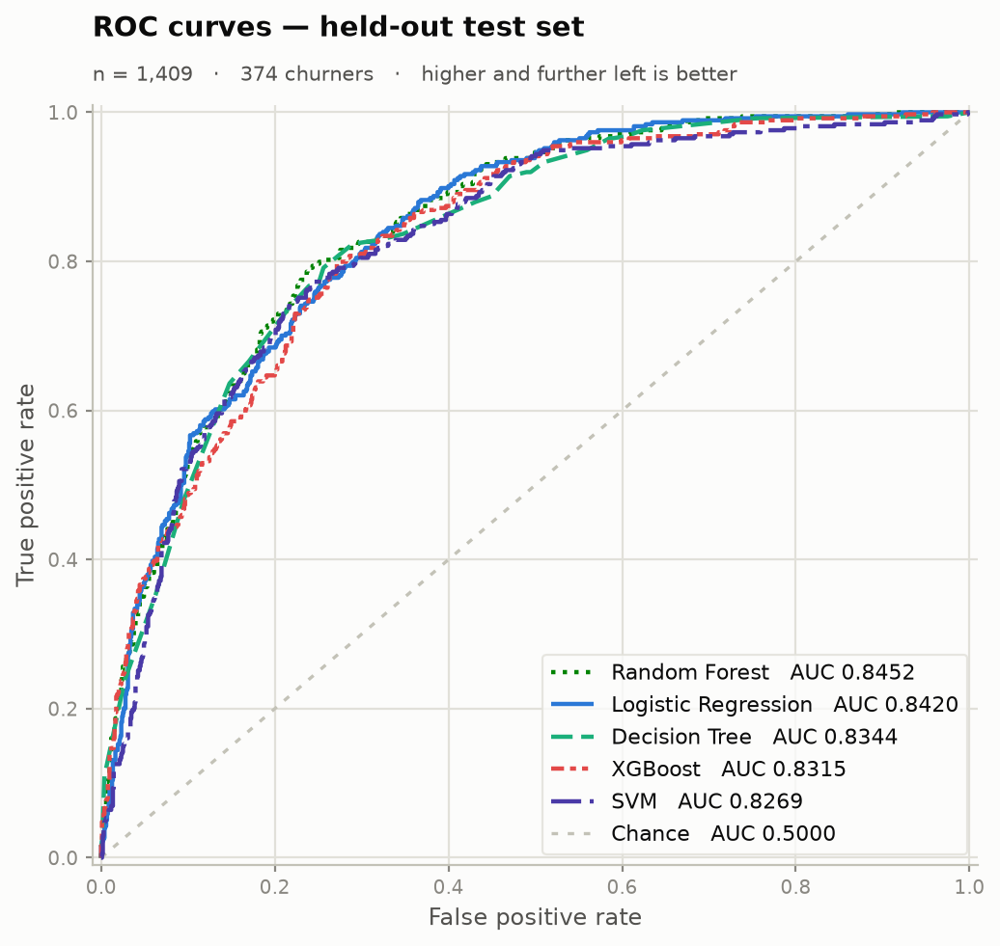
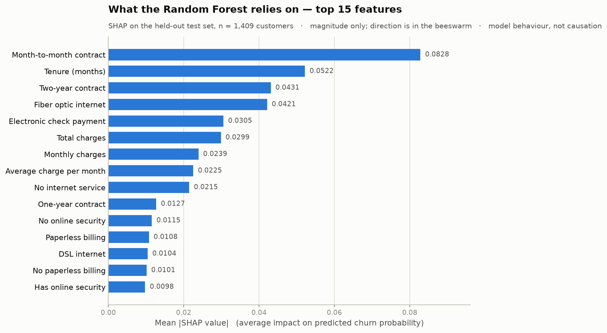

# Customer Churn Prediction with Machine Learning and Explainable AI

An end-to-end machine learning project that predicts telecom customer churn,
compares five classifiers, and explains every prediction with SHAP — delivered
as an interactive Streamlit application.

[](https://churniqwithai.streamlit.app/)

---

## 🚀 Live Demo

### Try the Live Application

**[Open ChurnIQ – Customer Intelligence](https://churniqwithai.streamlit.app/)**

Enter any customer profile and receive an instant churn probability, risk
category, and a SHAP explanation showing which factors drove the prediction.
No sign-up required.


---

## Project Overview

Customer churn — when a subscriber cancels their service — is one of the most
costly problems in the telecom industry. Acquiring a new customer costs far more
than retaining one, so operators need two things from a model:

1. **Which customers are at risk** — specifically a model that finds churners
   rather than one that looks accurate by agreeing with the majority class.
2. **Why the model says so** — because a bare risk score cannot be acted on and
   will not be trusted by a retention team.

This project answers both. It trains five classifiers on the IBM Telco Customer
Churn dataset, selects the strongest model on a principled metric (PR-AUC), and
uses **SHAP** (SHapley Additive exPlanations) to decompose every prediction into
per-feature contributions that a human can read and challenge.

---

## Key Features

| Feature | Detail |
|---|---|
| Data preprocessing | Blank-value resolution, feature collapse, leakage-free design |
| Exploratory Data Analysis | Class balance, charge distributions, churn by contract and payment type |
| Five ML models | Logistic Regression, Decision Tree, Random Forest, SVM, XGBoost |
| Cross-validation | Stratified 5-fold CV on the training set only |
| Class imbalance handling | Cost re-weighting inside each estimator (no data resampling) |
| SMOTE experiment | Separate cross-validation run comparing oversampling vs. re-weighting |
| Evaluation metrics | Accuracy, Precision, Recall, F1, ROC-AUC, PR-AUC |
| ROC & PR curves | All five models plotted on the held-out test set |
| SHAP explainability | Global importance, beeswarm, per-customer waterfall |
| Interactive application | Streamlit app — live predictions with SHAP explanations |

---

## Dataset

| | |
|---|---|
| **Source** | [IBM Telco Customer Churn](https://github.com/IBM/telco-customer-churn-on-icp4d) |
| **Records** | 7,043 customers |
| **Columns** | 21 (before feature engineering) |
| **Target** | `Churn` (Yes / No) |
| **Churn rate** | 26.54% — the minority class this study targets |
| **Integrity** | SHA-256 verified on every download |

Because 73.46% of customers do not churn, **accuracy alone is misleading** — a
model that always predicts "no churn" scores 73.46% while catching zero churners.
Recall, F1, and PR-AUC are the metrics that matter here.

---

## Project Structure

```
customer-churn-prediction/
├── app/
│   ├── streamlit_app.py       # Main Streamlit entry point
│   ├── ui_components.py       # UI helpers and pure logic functions
│   └── ui_styles.py           # CSS tokens, styling, brand assets
│
├── artifacts/
│   ├── random_forest.pkl      # Selected model pipeline (used by the app)
│   ├── decision_tree.pkl
│   ├── logistic_regression.pkl
│   ├── svm.pkl
│   ├── xgboost.pkl
│   ├── model_metadata.json    # Training environment and CV results
│   ├── model_cv_results.csv   # 5-fold CV metrics for all models
│   ├── smote_cv_results.csv   # SMOTE experiment results
│   └── test_results.csv       # Final test-set metrics (Stage 4)
│
├── data/
│   ├── raw/
│   │   └── Telco-Customer-Churn.csv
│   └── processed/
│       ├── train.csv          # 5,634 rows, stratified 80% split
│       └── test.csv           # 1,409 rows, held out until Stage 4
│
├── docs/
│   └── proposal.txt           # Project proposal
│
├── notebooks/
│   └── 01_eda.ipynb           # Exploratory Data Analysis (Stage 2)
│
├── reports/
│   └── figures/               # All generated PNGs (Stages 2, 4, 5)
│       ├── model_comparison.png
│       ├── roc_curves.png
│       ├── pr_curves.png
│       ├── shap_feature_importance.png
│       ├── shap_beeswarm.png
│       └── ...
│
├── src/
│   ├── config.py              # Paths, constants, column groups
│   ├── data_loader.py         # Download, load, SHA-256 validate
│   ├── preprocess.py          # Clean, engineer features, split
│   ├── train.py               # Train five model pipelines
│   ├── evaluate.py            # Metrics, curves, confusion matrices
│   ├── explain.py             # SHAP explanations
│   └── smote_experiment.py    # SMOTE vs. class-weight comparison
│
├── tests/
│   ├── test_stage1.py         # Preprocessing correctness and no-leakage tests
│   └── test_stage6_ui.py      # UI helpers, risk banding, SHAP regrouping
│
├── run_stage1.py              # Data download, clean, split
├── run_stage3b.py             # Train all models + SMOTE experiment
├── run_stage4.py              # Final test-set evaluation
├── run_stage5.py              # SHAP explanations
├── requirements.txt
├── .streamlit/config.toml     # App theme and display settings
└── README.md
```

---

## Machine Learning Workflow

```
IBM Telco Dataset (7,043 customers)
         │
         ▼
  Validation & Cleaning
  • SHA-256 checksum verified
  • Blank TotalCharges → 0 (tenure-0 customers, not median)
  • Structural placeholders collapsed
  • customerID dropped immediately
         │
         ▼
  Feature Engineering
  • is_new_customer  (tenure == 0)
  • num_services     (count of active services)
  • avg_charge       (TotalCharges / tenure, clipped)
         │
         ▼
  Stratified Train/Test Split  (80% / 20%, seed 42)
  Train: 5,634 rows │ Test: 1,409 rows (untouched until Stage 4)
         │
         ▼
  5-Fold Stratified Cross-Validation  (training set only)
  • Preprocessor fitted inside each fold
  • No test data seen during selection
         │
         ▼
  Five Model Pipelines Trained
  Logistic Regression · Decision Tree · Random Forest · SVM · XGBoost
  All with class re-weighting for the 26.5% minority class
         │
         ▼
  Model Selected on CV PR-AUC → Random Forest
         │
         ▼
  Final Evaluation on Held-Out Test Set  (Stage 4, opened once)
         │
         ▼
  SHAP Explanations  (Stage 5)
  Global importance · Beeswarm · Per-customer waterfall
         │
         ▼
  Streamlit Application  (Stage 6)
  Live predictions with SHAP contributions per customer
```

---

## Models Compared

Five classifiers were trained using the same preprocessing pipeline, the same
stratified cross-validation strategy, and the same class re-weighting approach.
The goal was to identify which model best recovers the minority churn class, not
merely which one achieves the highest accuracy.

| Model | Notes |
|---|---|
| **Logistic Regression** | Linear baseline; fast, interpretable |
| **Decision Tree** | Depth-limited tree; easy to visualise |
| **Random Forest** | Ensemble of 300 trees; selected model |
| **Support Vector Machine** | Calibrated via Platt scaling for probabilities |
| **XGBoost** | Gradient-boosted trees with `scale_pos_weight` |

---

## Model Performance

Final evaluation on the **1,409 held-out test customers** (opened once, after
model selection):

| Model | Accuracy | Precision | Recall | F1 | ROC-AUC | PR-AUC |
|---|---:|---:|---:|---:|---:|---:|
| Logistic Regression | 0.7388 | 0.5052 | 0.7834 | 0.6143 | 0.8420 | 0.6339 |
| Decision Tree | 0.7566 | 0.5276 | 0.7914 | 0.6332 | 0.8344 | 0.6225 |
| **Random Forest** | **0.7594** | **0.5311** | **0.7995** | **0.6382** | **0.8452** | **0.6517** |
| SVM | 0.7871 | 0.5930 | 0.6310 | 0.6114 | 0.8269 | 0.6023 |
| XGBoost | 0.7580 | 0.5318 | 0.7380 | 0.6181 | 0.8315 | 0.6406 |

**Random Forest was selected as the final model** because it achieved the
strongest PR-AUC (0.6517), the highest Recall (0.7995), the best F1 (0.6382),
and the highest ROC-AUC (0.8452) on the untouched test set.

> **Note on accuracy:** SVM achieved the highest accuracy (0.7871) but found far
> fewer churners (Recall 0.6310) and had the weakest PR-AUC (0.6023). For a churn
> problem where missing a churner is the costly error, SVM is the worse model
> despite its higher accuracy score.





---

## SMOTE Experiment

As an additional experiment, the same 5-fold cross-validation was re-run using
**SMOTE** (Synthetic Minority Oversampling Technique) inside each pipeline fold
and compared against cost re-weighting. Key results from `artifacts/smote_cv_results.csv`:

| Model | Class Weight PR-AUC | SMOTE PR-AUC | Difference |
|---|---:|---:|---:|
| Logistic Regression | 0.6583 | 0.6559 | +0.0024 |
| Decision Tree | 0.6152 | 0.5429 | +0.0722 |
| Random Forest | 0.6633 | 0.6465 | +0.0168 |
| SVM | 0.6125 | 0.6131 | −0.0006 |
| XGBoost | 0.6476 | 0.6461 | +0.0015 |

Class weighting produced equal or better PR-AUC for **4 of 5 models**. SMOTE was
**not adopted** in the final pipeline — it added synthetic rows without buying
improvement on the metric used for selection.

---

## Explainable AI

The deployed Random Forest is a 300-tree ensemble. SHAP (TreeExplainer) decomposes
each prediction into per-feature contributions that sum exactly to the gap between
the model's baseline output and the predicted probability.

### Global feature importance



### Key findings from the test set

The following associations were found in the model's predictions on the 1,409
held-out customers:

- **Month-to-month contracts** are strongly associated with *higher* predicted churn risk
- **Two-year contracts** are associated with *lower* predicted churn risk
- **Longer tenure** (months with the company) is associated with *lower* predicted risk
- **Fiber optic internet service** is associated with *higher* predicted risk
- **Electronic check payment** is associated with *higher* predicted risk

> **Important:** SHAP explains how the model forms its predictions — the
> associations it learned from one provider's historical data. A large SHAP
> contribution does not mean the feature *causes* churn, and nothing on this page
> should be read as evidence that changing a feature would change a customer's
> behaviour.

---

## Streamlit Application

The interactive app reads the saved pipeline and pre-generated artifacts. It does
not retrain anything.

### Pages

| Page | What it shows |
|---|---|
| **Predict Churn** | Customer form → churn probability, risk category, SHAP contributions |
| **Model Performance** | Test-set metrics, model comparison table, ROC and PR curves |
| **Explainable AI** | Global feature importance, beeswarm plot, individual customer examples |
| **About This Project** | Dataset, workflow, tech stack, limitations |

For any customer you enter, the app returns:

- **Churn probability** (0 – 100%)
- **Risk category** (Low / Medium / High)
- **SHAP contribution per field** — which answers pushed the prediction toward or
  away from churn, and by how much

---

## Installation

### Using uv (recommended)

```bash
git clone https://github.com/imranonweb/customer-churn-prediction.git
cd customer-churn-prediction

uv venv
# Windows:
.venv\Scripts\activate
# macOS / Linux:
source .venv/bin/activate

uv pip install -r requirements.txt
```

### Using pip

```bash
git clone https://github.com/imranonweb/customer-churn-prediction.git
cd customer-churn-prediction

python -m venv .venv
# Windows:
.venv\Scripts\activate
# macOS / Linux:
source .venv/bin/activate

pip install -r requirements.txt
```

---

## Running the Streamlit App

All model artifacts and figures are pre-generated and committed to the repository.
No training step is required before running the app.

```bash
python -m streamlit run app/streamlit_app.py
```

The app opens at `http://localhost:8501`.

---

## Reproducing the Full ML Pipeline

Only needed if you want to retrain models or regenerate figures from scratch.

```bash
# Stage 1 — Download data, clean, split
python run_stage1.py

# Stage 3 — Train all five models (and SMOTE experiment)
python run_stage3b.py

# Stage 4 — Evaluate on the held-out test set
python run_stage4.py

# Stage 5 — SHAP explanations
python run_stage5.py
```

---

## Running Tests

```bash
python -m pytest -q
```

Expected result: **54 passed**.

The test suite covers:

- Raw data shape, column names, target values
- Blank TotalCharges imputation (zero, not median)
- Feature engineering correctness
- No data leakage in the preprocessing step
- Train/test split sizes and stratification
- Preprocessor is unfitted before the split
- UI risk banding and SHAP value regrouping
- Form-to-model input contract

---

## Tech Stack

### Python Environments

| Environment | Python Version |
|---|---|
| Development & Model Training | Python 3.14.6 |
| Deployment Compatibility Testing | Python 3.13.14 |
| Production Deployment (Streamlit Community Cloud) | Python 3.13.15 |

> The machine learning pipeline was developed and trained locally using Python 3.14.6.
> Before deployment, model compatibility was verified using Python 3.13.14. The
> production application is currently deployed on Streamlit Community Cloud using
> Python 3.13.15.

### Core Packages

| Package | Version used during training |
|---|---|
| scikit-learn | 1.9.0 |
| XGBoost | 3.4.1 |
| SHAP | 0.52.0 |
| pandas | 3.0.5 |
| NumPy | 2.5.2 |
| Streamlit | 1.62.0 |
| Matplotlib | 3.11.1 |
| seaborn | 0.13.2 |
| joblib | 1.5.3 |
| imbalanced-learn | 0.14.2 |

---

## Limitations

- **Single provider, single market.** The model was trained on one telecom
  provider's customers. Contract types, payment methods, and service mix differ
  between markets; these numbers should not be transferred elsewhere without retraining.
- **Explanation ≠ causation.** SHAP explains the model, not the world. A feature
  can matter to the model because it correlates with something the dataset never
  recorded.
- **No time dimension.** The dataset is a historical snapshot with no timestamps.
  It cannot express seasonality, a tariff change, or a competitor entering the market.
- **No production monitoring.** If real customer behaviour drifted from this
  snapshot, the application would keep answering confidently and would not notice.
- **Bands are not optimised thresholds.** Low / Medium / High are presentation
  categories for reading a probability. No decision threshold was optimised against
  a cost matrix.

---

## 👨‍💻 Meet the Developer

**Md.Al Imran Emon**

Independent developer of the complete Customer Churn Prediction + Explainable AI
project — from data preprocessing and model training through SHAP explainability
and the deployed Streamlit application.
